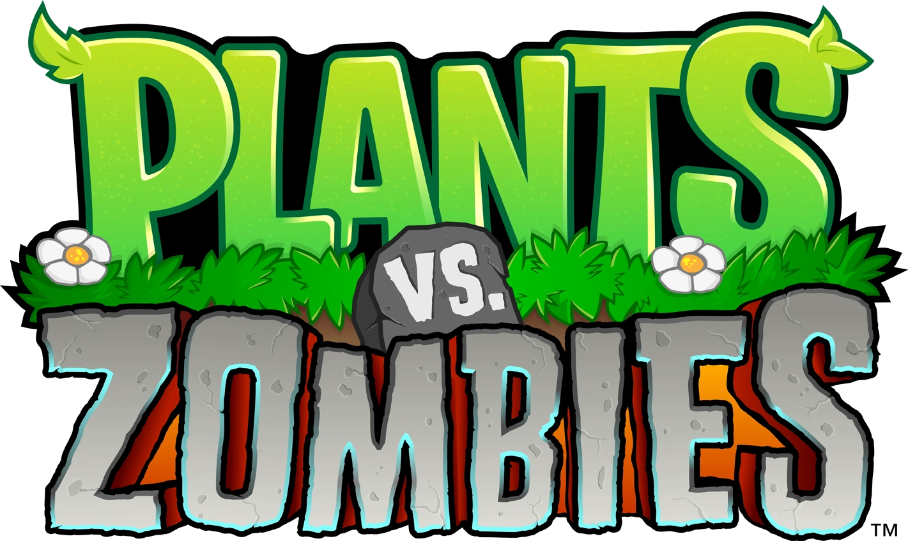

<div width="fit-content" style="display: flex; justify-content: center" align="center">
    
    
    
</div>
<div align="center">
    
    <h1>Plants vs. Zombies I, Zombie Bungee Glitch AutoHotkey</h1>
</div>

AutoHotkey script exploiting the Bungee Zombie glitch in the I, Zombie puzzle game mode in Plants vs. Zombies: Game of the Year Edition.

## The Glitch

In the I, Zombie game mode, Bungee Zombies, instead of eating plants, descend from above and remove the plants by pulling them upwards out of the ground. When removed, sunflowers will drop 200 sun points each. Unlike being eaten, a sunflower drops all the sun at once when removed by a Bungee Zombie. The glitch allows for multiple Bungee Zombies to be simultaneously placed on a single sunflower. If timed correctly, the sunflower will be removed multiple times and will drop 200 sun for each Bungee Zombie that was placed on top of it, yielding a greater sun profit.

Here's how it works:
1. Click the Bungee Zombie's "seed" card to select it
2. Quickly pause the game
3. Move the mouse cursor to the desired sunflower
4. Unpause the game
5. Rapidly click on the sunflower to place the Bungee Zombie on top of it
6. Quickly pause the game once more
7. Move the mouse cursor back to the Bungee Zombie's "seed" card
8. Quickly unpause the game again
9. Repeat steps 1 through 8 as many times as possible

Each Bungee Zombie costs 125 sun points to use, and each sunflower will grant 200 sun points when removed. If n Bungee Zombies are placed, the total profit, when timed correctly, becomes: `200(n) - 125(n) = 75(n)`.

This glitch is often exploited in I, Zombie Endless to obtain the [Better Off Dead](https://plantsvszombies.fandom.com/wiki/Better_Off_Dead) achievement. The achievements requires the player to gain a win streak of ten in I, Zombie Endless.

<div align="center">
    
    <p>The Steam icon for the Better Off Dead achievement</p>
</div>

## Usage

The script requires the positions of the Bungie Zombie's "seed" card and the sunflower's tile. The screen coordinates for both can be retrieved from AutoHotkey Window Spy. Simply move the mouse cursor over the target and mark down the default client coordinates.

<div align="center">
    
    <p>Mouse coordinates shown in AutoHotkey Window Spy</p>
</div>

Under the "Positions" section of the script, replace the placeholder values with the proper x and y values on your system.
```
...

; Positions
; ---------------------------- 
BungeeZombieX := 0  ; REPLACE
BungeeZombieY := 0  ; REPLACE
SunflowerX := 0     ; REPLACE
SunflowerY := 0     ; REPLACE

...
```

The multiplication key (*) on the number pad is used to place the Bungee Zombies on the specified sunflower. The subtraction key (-) on the number pad is used to collect the sun dropped when the Bungee Zombies have picked up the sunflower. One press of the multiplication key will place multiple Bungee Zombies, whereas one press of the subtraction key will collect one instance of sun; therefore, it is recommended to hold down the subtraction key to collect all the sun quickly.

The default values determining the number of Bungee Zombies to spawn, as well as the values determining the delay between clicks and key presses, can be modified to best meet your preferences.

## References

- Video explanation of the glitch and how to exploit it, by NecroarcanistXIII: https://www.youtube.com/watch?v=uk5jtypY4Wk
- Plants vs. Zombies Wiki: https://plantsvszombies.fandom.com/